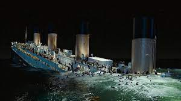

```{r}
library(tidyverse)
library(ggplot2)
library(ggpie)
```

```{r}

```

# INTRODUCTION
here we will explore the data about the passengers of a renowed boat, RMS Titanic. At the end of this project, we might unfold some facts about its passengers through this document. For the start, let's import the data!

# PREPARING THE DATA

```{r}
tnc <- read.csv("Titanic.csv")
```

```{r}
dim(tnc)
```

```{r}
head(tnc)
```

```{r}
tail(tnc)
```
## Scrutinizing the data types
```{r}
str(tnc)
```


```{r}
str(tnc)
```

## Check if there is any missing value
```{r}
anyNA(tnc)
```

```{r}
colSums(is.na(tnc))
```

## Putting out the missing value off the table

```{r}
tnc <- na.exclude(tnc)
dim(tnc)
```

## Summarizing the data
```{r}
summary(tnc)
```

## Checking the unique of each column

```{r}
sapply(tnc, n_distinct)
```

```{r}
unique(tnc$Survived)
unique(tnc$Pclass)
unique(tnc$Sex)
unique(tnc$Embarked)
```

Here are some facts and explanation about the data

1. PassengerId is unique for each passenger, there won't be any similar passenger id

2. Survived contains 2 category. 0 = not survived, 1 = survived

3. Pclass is passenger class

4. Name, Sex, Age are what they are

5. SibSp is the total of siblings on board on the RMS Titanic

6. Parch is the total of parents/children on board on the RMS Titanic

7. Ticket is the distinctive id for each ticket, or ticket number

8. Fare is the ticket price. the mean for the ticket price is 40.98 dollar and the most expensive ticket charges at 512.33 dollar

9. Cabin is the number of Cabin the passenger stayed at (if they were in Cabin)

10. Embarked is the port of Embarkation. C = Cherbourg, Q = Queenstown; S = Southampton

Now, I will remove the columns: SibSp, Parch, as it does not tell much the relation between each variables or observations

```{r}
tnc <- tnc[,-c(7:8)]
names(tnc)
```

# 3. DATA VISUALIZATION

```{r}
head(tnc)
```
## Proportion of Males and Females On Board
```{r}
ggpie3D(data = tnc, group_key = "Sex", 
        count_type = "full", 
        tilt_degrees = 8, 
        label_size=2) + 
  ggtitle("Percentage Between Males and Females On Board") + 
  theme(plot.title = element_text(hjust = 0.5))
```
The total of males and females recorded in the data, there are 62% of male with the total of 204 passengers, and 38% females with the total of 127 passengers

## Ticket per Class
```{r}
ggplot(tnc, aes(Pclass, Fare))+
  geom_col(aes(fill= Sex), position = "dodge")+
  geom_jitter(aes(col=Survived, size=Fare))+
  labs(title = "Ticket Fare per Class of Titanic Passenger", 
       x = "Passenger Class")+
  theme(plot.title = element_text(hjust = 0.5))
```
from the graph above we can see that:

1. the most expensive ticket fare was first class ticket, which was bought by female for a total of 500+ dollar

2. the cheapest ticket fare was third class ticket, which was bought by female for slightly below 50 dollar in total

3. there is a passenger of first class without paying a single penny

4. the majority of the data is the third class passengers

5. there are first class ticket which has the same Fare with second and third class, which is under 100 dollars

6. the Fare for second and third class are under 100 dollars

Based on insight number #3, let's uncover who was not paying a single penny to get on board the RMS Titanic

```{r}
filter(tnc, Pclass == 1, Fare == 0)
```
the free rider of a first class ticket is Mr. Joseph Bruce Ismay, which was probably the owner, special guest, or the important crew of the RMS Titanic

## Passenger's Age In Each Sex

```{r}
ggplot(tnc, aes(Sex, Age))+
  geom_boxplot(outlier.shape=NA, aes(fill=Sex), col="Blue")+
  geom_jitter(alpha=0.5, col="orange")+
  labs(title = "Passengers Age")+
  theme(plot.title = element_text(hjust = 0.5))
```
from the data above we can see that:

1. the most, second-most, and third-most passengers' age for both sex fall in between the age of 20-40, 41-60, and 0-20 respectively

2. there are babies on board 

3. the oldest male passenger is under 70

4. the oldest female passenger is above 70

5. the average age for both sex is almost the same

## Proportion of Passenger Survived Grouped Based on Sex
```{r}
ggplot(tnc, aes(Sex, Survived))+
  labs(title = "Passenger Survived", 
       x = "Sex",
       y = "Survived")+
  geom_bar(stat = "identity", aes(fill= Sex))+
  coord_polar("y", start=0, direction = 1)+
  theme_void()
```
as we can see from the pie chart above that all survived passengers of Titanic accident are female. To prove it, let's see it through the table.

```{r}
filter(tnc, Survived == 1, Sex == "male")
```


```{r}
filter(tnc, Survived == 0, Sex == "female")
```

from the data above, we can conclude that all females recorded in the data are survived the accident, and all males recorded in the data are not survived the accident. 

## Percentage of Embarkation In Each Port

```{r}
ggrosepie(data = tnc, group_key = c("Embarked", "Sex"), 
          count_type = "full", 
          label_info = "all",
          show_tick = F,
          donut_frac = NULL,
          donut_label_size = "5") + 
  ggtitle("Percentage of Embarkation In Each Port") + 
  theme(plot.title = element_text(hjust = 0.5))
```
```{r}
ggplot(tnc, aes(Embarked, Sex))+
  geom_col(aes(fill = Sex), position = "fill", 
           show.legend = F)+
  labs(title = "Proportion Based On Sex In Each Embarkation Port", 
       x = "Passenger Class")+
  theme(plot.title = element_text(hjust = 0.5))
```
from 2 graphs depicted above, the data show that :

1. Port Southampton has the highest embarkation with the total of 69% total passengers, with majority of males

2. Port Cherbourg has the second highest of embarkation with the total of 25% total passengers, with majority of males

3. Port Queesntown has the least total passengers embarkation with the total of 7%. However, the proportion of females between port is the highest in this port

From the  **"Percentage of Embarkation in Each Port"** graph above, we can see the percentage of passengers that embarked in each embarkation port. unfortunately, the graph does not tell us how much is the proportion between males and females, so we should see it from the  graph **"Proportion Based On Sex In Each Embarkation Port"**. Those 2 graphs is quite ineffective since we can actually do it within a single graph. In the next visualization, we will be trying to see both info in a single visualization. However, the data present will be seeing how much the proportion of males and females in each class. 
```{r}

```

## Proportion of Males And Females In Each Class
```{r}
ggnestedpie(tnc, group_key = c("Pclass", "Sex"), count_type = "full",
            inner_label_info = "all", 
            inner_label_split = NULL,
            inner_label_size = 2,
            outer_label_type = "circle", 
            outer_label_pos = "in", 
            outer_label_info = "all")+
  labs(title = "Proportions of Males And Females In Each Class")+
  theme(plot.title = element_text(hjust=0.5))
```
From the Nested Pie Chart above we can see that:

1. The proportion of 1st class is the second highest which standing at 29.6% total passengers of all classes, with proportion of males is 15.11% and females is 14.50% of all passengers in all classes

2. The proportion of 2nd class is the least, standing at 26.6% total passengers of all classes, with proportion of males is 17.82% and females is 8.76% of all passengers in all classes

3. The proportion of 3rd class is the majority of all passengers come from which is 43.8% total passengers of all classes, with proportion of males is 28.70% and females is 15.11% of all passengers in all classes

